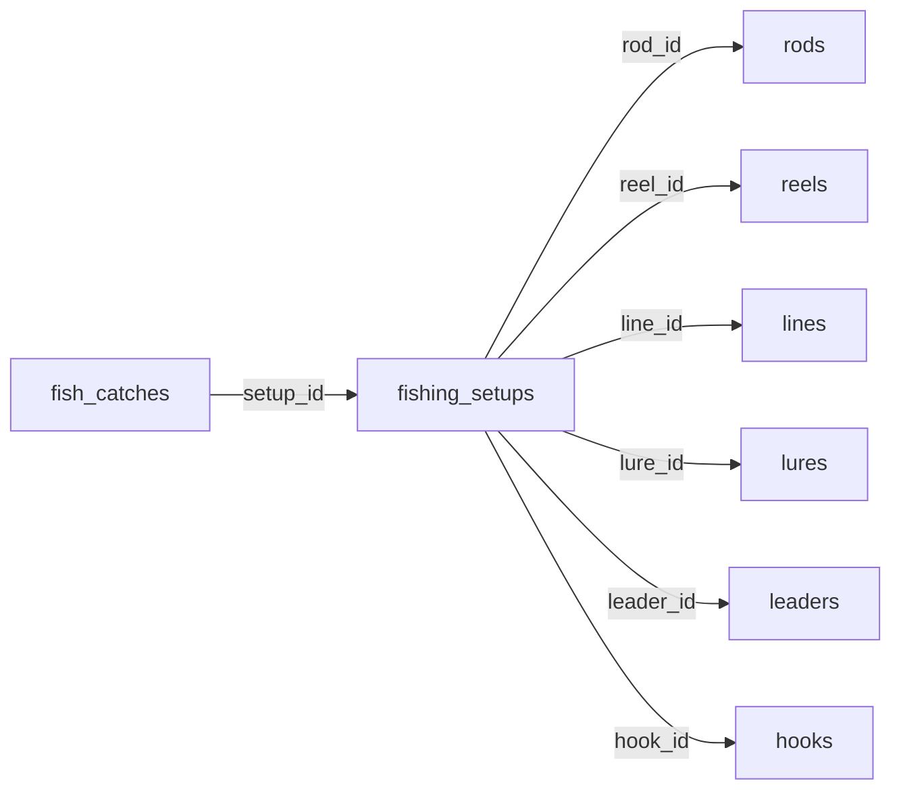

# 🎣 MONTAGES - MIGRATION VERS FOREIGN KEYS

## ✅ MIGRATION TERMINÉE

### 🎯 Objectif
Migrer les montages pour utiliser **le matériel déjà enregistré** au lieu de saisir manuellement les informations.

---

## 📊 Schéma de base de données AVANT

```sql
CREATE TABLE fishing_setups (
  id SERIAL PRIMARY KEY,
  user_id UUID NOT NULL,
  rod_brand TEXT,           -- ❌ Champs texte
  rod_model TEXT,
  rod_length DOUBLE PRECISION,
  reel_brand TEXT,
  reel_model TEXT,
  ...
);
```

## 📊 Schéma de base de données APRÈS

```sql
CREATE TABLE fishing_setups (
  id SERIAL PRIMARY KEY,
  user_id UUID NOT NULL,
  rod_id BIGINT,            -- ✅ Foreign Keys
  reel_id BIGINT,
  line_id BIGINT,
  lure_id BIGINT,
  leader_id BIGINT,
  hook_id BIGINT,
  description TEXT,
  is_favorite BOOLEAN,
  is_current BOOLEAN,
  FOREIGN KEY (rod_id) REFERENCES rods(id),
  FOREIGN KEY (reel_id) REFERENCES reels(id),
  ...
);
```

---

## 🔧 Modifications apportées

### 1. **Script SQL de migration** ✅
Fichier : `database/migration_setups_to_fk.sql`

**Actions :**
- Suppression des anciens champs texte (`rod_brand`, `reel_brand`, etc.)
- Ajout des nouvelles colonnes FK (`rod_id`, `reel_id`, etc.)
- Ajout des contraintes de clés étrangères
- Création d'index pour les performances

⚠️ **IMPORTANT** : Ce script supprimera les montages existants. Sauvegardez-les avant !

### 2. **Modèle C# - FishingSetup.cs** ✅
```csharp
public class FishingSetup
{
    public int Id { get; set; }
    public string UserId { get; set; }

    // Foreign Keys vers le matériel
    public long? RodId { get; set; }
    public long? ReelId { get; set; }
    public long? LineId { get; set; }
    public long? LureId { get; set; }
    public long? LeaderId { get; set; }
    public long? HookId { get; set; }

    public string? Description { get; set; }
    public bool IsFavorite { get; set; }
    public bool IsCurrent { get; set; }
}
```

### 3. **SupabaseService.cs** ✅
Méthodes mises à jour pour envoyer `rod_id` au lieu de `rod_brand` :

```csharp
var setupToSend = new
{
    user_id = setup.UserId,
    rod_id = setup.RodId,      // ✅ FK
    reel_id = setup.ReelId,
    line_id = setup.LineId,
    ...
};
```

### 4. **Pages Razor avec Dropdowns** ✅

#### `Pages/Montages/Ajouter.razor`
- Dropdowns pour sélectionner le matériel existant
- Charge `rods`, `reels`, `lines`, etc. via `EquipmentService`
- Affiche "Aucune canne. Ajoutez-en une" si pas de matériel

#### `Pages/Montages/Modifier.razor`
- Même principe avec pré-sélection du matériel actuel

#### `Pages/Montages/Index.razor`
- Charge le matériel en parallèle avec les montages
- Affiche les détails en résolvant les FK :
```csharp
var rod = rods.FirstOrDefault(r => r.Id == setup.RodId);
if (rod != null)
{
    <div>🎣 @rod.Brand @rod.Model</div>
}
```

---

## 🚀 Étapes d'installation

### 1. Exécuter le script SQL sur Supabase

```sql
-- Copier le contenu de database/migration_setups_to_fk.sql
-- Exécuter dans SQL Editor de Supabase
```

⚠️ **ATTENTION** : Cela supprimera tous les montages existants !

### 2. Tester l'application

1. Allez dans **"Mon Matériel"** et ajoutez du matériel :
   - Cannes
   - Moulinets
   - Fils
   - Leurres
   - Bas de ligne
   - Hameçons

2. Allez dans **"Mes Montages"** :
   - Cliquez sur "Nouveau montage"
   - Sélectionnez le matériel dans les dropdowns
   - Enregistrez

3. Le montage devrait afficher le matériel sélectionné

---

## 📝 Avantages de cette approche

✅ **Cohérence des données** : Un matériel = Une seule source de vérité  
✅ **Facilité d'utilisation** : Sélection dans une liste au lieu de saisie manuelle  
✅ **Traçabilité** : Suivi de quel matériel est utilisé dans quels montages  
✅ **Statistiques** : Possibilité de savoir quel matériel est le plus utilisé  
✅ **Intégrité référentielle** : Les FK empêchent les données orphelines  

---

## 🎯 Ce qui a changé pour l'utilisateur

### AVANT (saisie manuelle)
```
Canne :
  Marque : [Shimano____]
  Modèle : [Zodias_____]
  Longueur : [2.4_______]
```

### APRÈS (sélection)
```
Canne : [ Shimano Zodias (2.4m) ▼ ]
        - Shimano Zodias (2.4m)
        - Daiwa Tatula (2.1m)
        - Abu Garcia (2.7m)
```

---

## 🔗 Liens avec d'autres tables



---

## ✅ Build Status
**Build successful** - Tout compile correctement

---

**Date de migration** : Maintenant  
**Raison** : Utiliser le matériel existant au lieu de saisie manuelle  
**Status** : ✅ PRÊT À DÉPLOYER (après migration SQL)
